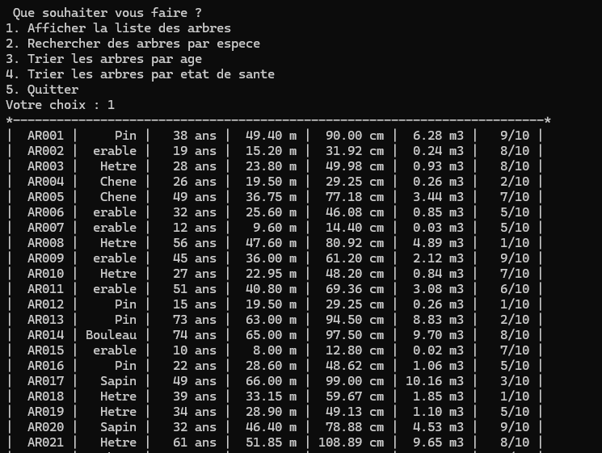
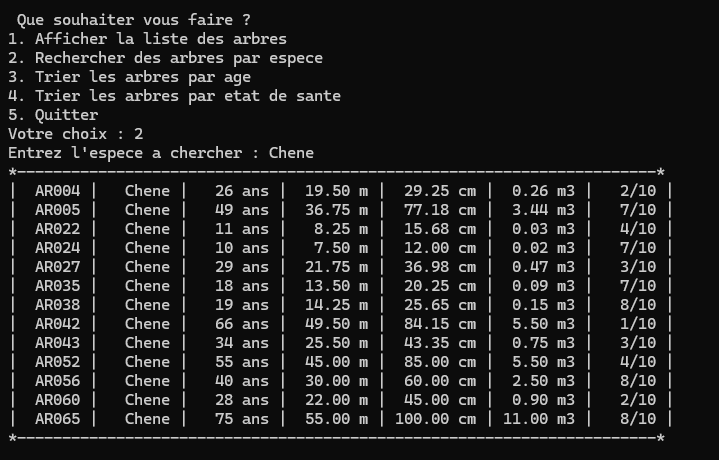
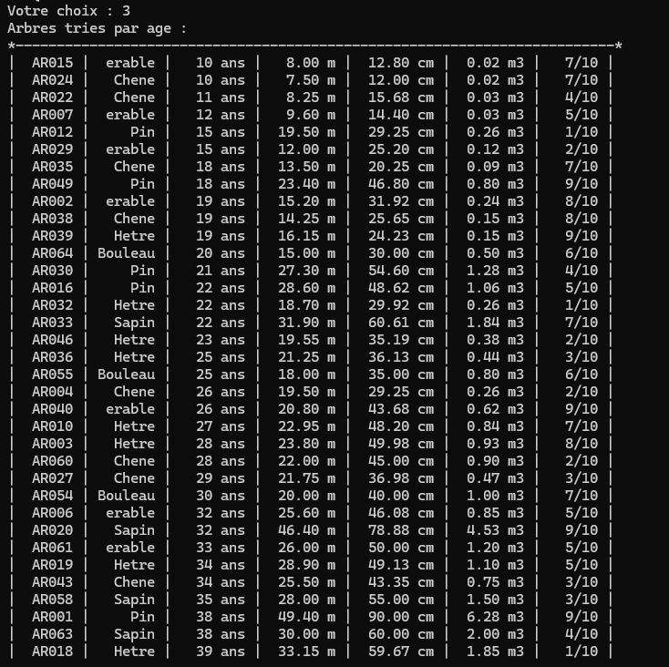

# Gestion d'un parc forestier

Application console en C qui centralise les données des arbres d'une parcelle de forêt :
chargement depuis un fichier CSV, affichage, recherche par espèce et tri selon deux critères.



## Le problème

Un office forestier souhaite suivre les arbres d'une parcelle : espèce, âge, hauteur, diamètre,
volume et état de santé. Les données sont stockées dans un fichier CSV. L'application doit les
charger en mémoire, permettre de les consulter et de les trier, le tout en C standard.

## Fonctionnalités

- Lecture du fichier CSV et chargement des données en mémoire dans un tableau de structures
- Affichage de l'ensemble des arbres sous forme de tableau aligné dans la console
- Recherche de tous les arbres d'une espèce donnée
- Tri par **âge** (tri par insertion) et par **état de santé** (tri par sélection)

| Recherche par espèce | Tri par âge |
|---|---|
|  |  |

## Technologies

- **Langage** : C (bibliothèque standard uniquement)
- **Notions** : structures (`typedef struct`), lecture de fichier (`fopen`, `fgets`, `sscanf`),
  algorithmes de tri

## Les deux tris

Le sujet imposait deux algorithmes de tri différents, un par critère :

| Critère | Algorithme | Principe |
|---|---|---|
| Âge | **Tri par insertion** | On prend chaque arbre et on le fait reculer jusqu'à sa place parmi ceux déjà triés. Très efficace si le tableau est presque trié. |
| Santé | **Tri par sélection** | On cherche le plus petit élément restant et on l'échange avec la première case non triée. Toujours le même nombre de comparaisons, mais peu d'échanges. |

Les deux sont en O(n²) dans le pire cas : pour une parcelle de quelques dizaines d'arbres, c'est
largement suffisant, et leur logique reste simple à vérifier.

## Format des données

Le fichier `test_fichiers.csv` utilise le point-virgule comme séparateur :

```
Identifiant;Espece;Age;Hauteur(m);Diametre(cm);Volume(m3);Sante(/10)
AR001;Pin;38;49.40;90.00;6.28;9
```

Les virgules décimales éventuelles (format français) sont converties en points à la lecture.

## Installation

Avec **gcc** (MinGW, w64devkit, Linux, macOS) :

```bash
git clone https://github.com/rhiewilliam-ui/parc-forestier.git
cd parc-forestier
gcc -Wall -o foret programme_principal.c
./foret
```

Avec **Visual Studio** (invite de commandes développeur) :

```
cl programme_principal.c
programme_principal.exe
```

Le programme lit `test_fichiers.csv` dans le dossier courant : lance-le depuis le dossier du projet.

## Mon rôle

Projet réalisé en équipe de 6 dans le cadre du BUT Informatique.
J'ai pris en charge les **algorithmes de tri** : le tri par insertion sur l'âge et le tri par
sélection sur l'état de santé, ainsi que la comparaison des deux méthodes présentée dans le rapport.

---

*SAÉ 1.02 — BUT Informatique, IUT d'Amiens, 2025.*
